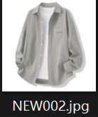
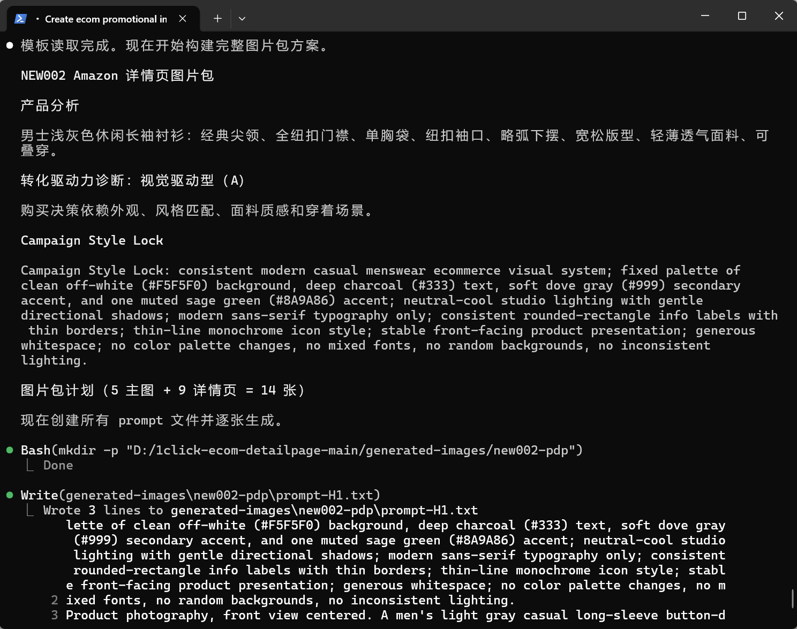

# aiset-ecom

一个面向 Claude Code / Codex / OpenClaw 的跨境电商和国内电商通用视觉创作 Skill，集 **AI 生图** 与 **视觉文案设计 SOP** 于一体。

与众不同之处是：**Campaign Style Lock** 机制、**强推广**、**重视转化效果**，以及内置**分品类合规规则库**和**用户确认门**，先过合规线，再谈转化率。

它可以做三件事：

- 生成可执行的视觉简报和 AI 生图 Prompt。
- 在使用者配置自己的 OpenAI 兼容图片 API 后，直接调用 API 生成图片。
- 根据产品资料和平台要求，输出可交给设计师直接上图的**视觉文案执行稿**（画面 + 图内文案 + 设计说明 + 合规自审）。

未配置 API 时，它仍然可以正常输出 Prompt 和文案方案；配置 API 后，可以直接出图。

## 功能特性

### AI 图像生成
- **一站式电商图片生成** — 商品主图、Amazon/Shopify 详情页、社媒推广、直播间场景等
- **25 种场景模板** — 覆盖白底主图、生活方式、平铺摆拍、细节特写、海报 Banner、社媒 UGC、模特展示、前后对比、包装设计、信息图、创意概念、尺码说明、多品组合、直播间、虚拟试穿、爆炸图、隐形人台、多角度网格、杂志编辑、季节Campaign、轻奢氛围、设备样机、店铺陈列、运动Campaign
- **Campaign Style Lock** — 多图自动锁定色板、冷暖调、字体、背景、光线、布局，保证整套图视觉一致
- **转化驱动力诊断** — 自动判断视觉驱动型 / 痛点驱动型 / 情感价值驱动型，针对性生成图片序列
- **参考图片支持** — 传入产品实拍图，让 AI 生成的产品外观更贴近真实商品
- **Prompt / Generate 双模式** — 可只输出 Prompt 供人工使用，也可直接调用 API 出图
- **零依赖生图脚本** — 纯 Python 标准库实现，无需 pip install

### 视觉文案设计 SOP（新功能）
- **6 步工作流** — 收集信息 → 提炼合规必卖理由 → 用户确认门 → 主图文案 → 详情页模块 → 合规自审评分
- **分品类合规规则库** — 自动匹配普通食品（最严）/ 蓝帽子保健食品 / 运动器材 / 通用规则四层合规边界
- **用户确认门** — 必卖理由必须经用户确认才能进入文案生成，防止违规宣称一路到底
- **自审评分机制** — 文案精简度、图内可放性、合规性、结构清晰度、实用性五维评分，低于 80 分强制重写
- **设计师直接可用** — 每张图只交付三项：画面内容、图内文案、设计说明，无多余解释
- **平台合规覆盖** — 内置淘宝/天猫/京东/拼多多/抖音小店各平台审查重点


## 致谢和参考

提示词 templates 参考和利用了开源项目 https://github.com/buluslan/gpt-image2-ecommerce ，
特别致谢 https://linux.do，感谢佬友的支持。感谢 https://github.com/coolqoo/1click-ecom-detailpage 提供灵感和初步工作！感谢 https://github.com/feichanggege/ecommerce-visual-copywriting-skill 提供视觉文案设计 SOP 和合规规则库！

## 快速开始

### 前置要求

- [Claude Code CLI / codex等] 已安装并登录
- Python 3.10+
- OpenAI 兼容图片生成 API（如 OpenAI、Azure OpenAI 或第三方兼容服务）

### 1. 克隆项目

```bash
git clone https://github.com/icodebase-cn/aiset-ecom.git
cd aiset-ecom
```

### 2. 配置 API

在项目根目录创建 `.env` 文件：

```dotenv
IMG_BASE_URL=https://api.openai.com/v1
IMG_MODEL=gpt-image-1.5
IMG_API_KEY=your-api-key-here
```

| 变量 | 说明 | 示例 |
|------|------|------|
| `IMG_BASE_URL` | API 根地址 | `https://api.openai.com/v1` |
| `IMG_MODEL` | 图片模型名称 | `gpt-image-1.5`、`dall-e-3` |
| `IMG_API_KEY` | API 密钥 | `sk-...` |

也兼容以下环境变量别名：`OPENAI_BASE_URL`、`OPENAI_API_BASE`、`OPENAI_IMAGE_MODEL`、`OPENAI_MODEL`、`OPENAI_API_KEY`。

### 3. 在 Claude Code 中使用

启动 Claude Code 后，直接用自然语言描述需求即可：

```
基于 data/NEW002.jpg 这款男士白衬衫，生成 Amazon 详情页全套图片
```





```
用 data/NEW003.jpg 生成 3 张 Twitter/X 推广帖子
```

```
基于 data/NEW004.jpg 生成电商直播间场景图
```

## 使用示例

### 示例 1：生成 Amazon PDP 详情页

```
基于 data/你的产品.jpg 生成 Amazon 详情页全套图片
```

自动输出 **5 张主图**（1024x1024）+ **9 张详情页图片**（1024x1536）：

| 主图 | 用途 |
|------|------|
| H1 | 首图卖点 — 一眼可懂的视觉主张 |
| H2 | 核心功能/质感特写 |
| H3 | 使用场景匹配 |
| H4 | 普通方案 vs 升级方案对比 |
| H5 | 优惠/物流/保障/CTA |

| 详情页 | 用途 |
|--------|------|
| D1 | 首屏承接 — 产品为谁解决什么问题 |
| D2 | 痛点放大 — 展示用户当前不便 |
| D3 | 机制解释 — 视觉化说明产品原理 |
| D4 | 核心利益 — 2-4 个主要利益信息图 |
| D5 | 使用步骤 — 3-4 步说明怎么用 |
| D6 | 场景覆盖 — 典型使用场景 |
| D7 | 对比选择 — 普通方案 vs 本产品 |
| D8 | 信任背书 — 材料/包装/质检/保障 |
| D9 | FAQ / 风险逆转 / CTA |

### 示例 2：生成社媒推广图

```
用 data/你的产品.jpg 生成 3 张 Twitter/X 推广帖子，风格要真实手机拍照感
```

### 示例 3：只输出 Prompt（不出图）

```
为我的护肤品设计一张主图 Prompt，白底棚拍风格
```

### 示例 4：直接使用生图脚本

```bash
# 直接传入 Prompt
python3 .claude/skills/aiset-ecom/scripts/generate_image.py \
  --prompt "clean product hero image, white background, studio lighting" \
  --size 1024x1024

# 从文件读取 Prompt，附带产品参考图
python3 .claude/skills/aiset-ecom/scripts/generate_image.py \
  --prompt-file my-prompt.txt \
  --image data/product.jpg \
  --output-dir generated-images \
  --size 1024x1536 \
  --format png
```

### 示例 5：视觉文案设计 SOP — 普通食品（合规文案）

适用场景：产品没有保健食品批文号，但需要电商主图和详情页文案。

```
产品类型：普通食品，非保健食品，非药品
品牌：熊花木末
产品：松花粉固体饮料
规格：60g/盒，独立小条装
主图初稿：突出速溶、小条便携、口感清爽、随身携带
证据：暂无保健食品批准文件
平台：淘宝 / 抖音小店
帮我做一套电商主图文案方案，先提炼必卖理由，等我确认后再继续出主图和详情页
```

Skill 会输出：

1. **合规版必卖理由**（暂停等用户确认）：独立小条包装便携、速溶口感、松花粉+植物成分、必须声明普通食品边界
2. **主图 5 张**（用户确认后生成）：每张只交付画面内容、图内文案、设计说明
3. **详情页模块**：M1–M8 按需选择
4. **合规自审评分** + 风险提示

### 示例 6：视觉文案设计 SOP — 运动器材（去医疗化改写）

适用场景：产品初稿文案含医疗化用语，需要合规改写。

```
产品类型：健身器材，非医疗器械
产品：体态训练弹力带
主图初稿：修复驼背，缓解腾胳痛，矫正脊柱问题
证据：无医疗器械证书
平台：京东 / 抖音小店
这段文案合不合规？帮我改成能上图的安全版本
```

Skill 会：

1. 标出高风险词：“修复”“缓解痛”“矫正脊柱”均属医疗化用语
2. 提供合规替换：修复 → 体态训练、缓解痛 → 肩背紧绑感、矫正脊柱 → 背部线条调整
3. 输出安全改写版主图文案 + 必要免责声明

**脚本参数：**

| 参数 | 说明 | 默认值 |
|------|------|--------|
| `--prompt` | 直接传入图片生成 Prompt | （与 --prompt-file 二选一） |
| `--prompt-file` | 从文本文件读取 Prompt | （与 --prompt 二选一） |
| `--image` | 参考产品图片路径，提升产品一致性 | 无 |
| `--output-dir` | 图片输出目录 | `generated-images` |
| `--size` | 图片尺寸 | `1024x1024` |
| `--quality` | 图片质量（low/medium/high） | 无 |
| `--format` | 图片格式（png/jpeg/webp） | `png` |
| `--n` | 生成数量 | `1` |
| `--env-file` | 指定 .env 配置文件 | 自动向上查找 |

## 项目结构

```
aiset-ecom/
├── .claude/
│   └── skills/
│       └── aiset-ecom/                # 核心技能模块
│           ├── SKILL.md               # Skill 定义和执行规则（含视觉文案 SOP）
│           ├── README.md              # Skill 详细文档
│           ├── .env.example           # API 配置模板
│           ├── .gitignore             # Git 忽略规则
│           ├── scripts/
│           │   └── generate_image.py  # 图片生成脚本（纯标准库）
│           └── references/
│               ├── compliance-rules.md    # 分品类合规规则库（新）
│               ├── examples/
│               │   └── copywriting-examples.md  # 文案设计示例库（新）
│               └── templates/             # 25 个 AI 生图场景模板
│                   ├── 01-hero-image.json
│                   ├── 02-lifestyle-scene.json
│                   ├── 03-flat-lay.json
│                   ├── 04-detail-macro.json
│                   ├── 05-poster-banner.json
│                   ├── 06-social-media.json
│                   ├── 07-ugc-style.json
│                   ├── 08-model-showcase.json
│                   ├── 09-before-after.json
│                   ├── 10-packaging.json
│                   ├── 11-infographic.json
│                   ├── 12-creative-concept.json
│                   ├── 13-size-spec.json
│                   ├── 14-multi-product.json
│                   ├── 15-livestream.json
│                   ├── 16-try-on-virtual.json
│                   ├── 17-exploded-view.json
│                   ├── 18-ghost-mannequin.json
│                   ├── 19-multi-angle-grid.json
│                   ├── 20-magazine-editorial.json
│                   ├── 21-seasonal-campaign.json
│                   ├── 22-luxury-atmospherics.json
│                   ├── 23-device-mockup.json
│                   ├── 24-storefront.json
│                   └── 25-sports-campaign.json
├── data/                              # 产品原图输入目录
├── generated-images/                  # AI 生成图片输出（已 gitignore）
└── .env                               # API 配置（不入库）
```

## 25 个场景模板一览

| # | 模板 | 触发关键词 | 适用场景 |
|---|------|-----------|---------|
| 01 | 商品主图 | 主图、hero、白底 | Amazon/淘宝首图、白底商品照 |
| 02 | 生活方式 | lifestyle、场景、生活场景 | 使用场景、氛围感商品照 |
| 03 | 平铺摆拍 | flat lay、平铺、俯拍 | 服装/美妆/配饰平铺展示 |
| 04 | 细节特写 | detail、特写、macro | 面料纹理、工艺细节、材质展示 |
| 05 | 海报Banner | poster、banner、海报 | 活动推广、首页Banner |
| 06 | 社媒内容 | social、社媒、小红书、Instagram | 社交平台种草图、UGC 内容 |
| 07 | UGC 风格 | UGC、用户晒单、真实评价 | 买家秀风格、真实使用场景 |
| 08 | 模特展示 | model、模特、真人上身 | 服装/配饰模特展示 |
| 09 | 前后对比 | before after、对比、效果 | 护肤/清洁/健身效果对比 |
| 10 | 包装设计 | packaging、包装、开箱 | 产品包装展示、开箱体验 |
| 11 | 信息图表 | infographic、信息图、参数 | 产品参数、成分、规格说明 |
| 12 | 创意概念 | creative、概念、创意 | 品牌视觉概念、艺术化表达 |
| 13 | 尺码说明 | size、尺码、规格表 | 服装尺码对照、穿着建议 |
| 14 | 多品组合 | multi、组合、套装、搭配 | 多款产品搭配、组合套装 |
| 15 | 直播间 | 直播、livestream、带货 | 抖音/淘宝直播间截图风格 |
| 16 | 虚拟试穿 | try on、试穿、换装 | 虚拟试穿效果展示 |
| 17 | 爆炸图 | exploded、爆炸图、拆解 | 产品结构拆解、组件展示 |
| 18 | 隐形人台 | ghost、人台、3D | 服装 3D 立体展示 |
| 19 | 多角度网格 | grid、多角度、360 | 多角度产品展示网格 |
| 20 | 杂志编辑 | magazine、editorial、杂志 | 高级编辑部大片风格 |
| 21 | 季节Campaign | seasonal、季节、节日 | 季节性营销活动 |
| 22 | 轻奢氛围 | luxury、轻奢、高级 | 高端品牌氛围感大片 |
| 23 | 设备样机 | mockup、样机、设备 | 手机/电脑产品样机展示 |
| 24 | 店铺陈列 | storefront、店铺、陈列 | 线下店铺/展柜陈列 |
| 25 | 运动Campaign | sports、运动、户外 | 运动品牌Campaign风格 |

## 工作原理

### Prompt / Brief 模式

当只需要策略和 Prompt 时，Skill 输出：

1. **视觉简报**（Visual Brief）— 目标、主体、受众、风格
2. **转化驱动力诊断** — 视觉驱动 / 痛点驱动 / 情感价值驱动
3. **Campaign Style Lock** — 锁定整套图的视觉一致性
4. **图片序列规划** — 主图序列 + 详情页序列
5. **Final Image Prompt** — 可直接执行的图片生成 Prompt
6. **负面约束** — 明确避免的内容

### Generate 模式

当明确要求生图时，Skill 额外执行：

1. 为每张图写入独立 Prompt 文件
2. 调用 `generate_image.py` 生成图片
3. 输出文件路径列表

### Campaign Style Lock 机制

多图任务自动生成一段风格锁定文本，包含：

- 固定色板（背景色、文字色、强调色）
- 冷暖调统一
- 字体系统（禁止混用）
- 背景系统统一
- 光线系统统一
- 布局和图标风格统一
- 禁止漂移项（色板变化、字体混用、光线不一致等）

同一段 Lock 文本会原样复制到每张图的 Prompt 开头，保证整套图视觉一致。

## 生成示例

本项目 `data/` 目录包含 4 张示例产品图，`generated-images/` 中有对应的生成结果：

| 产品 | 场景 | 生成数量 |
|------|------|---------|
| NEW001.jpg — 男士桑蚕丝短袖衬衫 | 促销推广图 | 2 张 |
| NEW002.jpg — 男士白色商务衬衫 | Amazon PDP 详情页全套 | 14 张 (5 主图 + 9 详情页) |
| NEW003.jpg — 男士白色长袖正装衬衫 | Twitter/X 社媒推广帖 | 3 张 |
| NEW004.jpg — 男士浅蓝色牛津纺衬衫 | 电商直播间场景 | 3 张 |

> `generated-images/` 已在 `.gitignore` 中忽略，不会提交到仓库。示例图片需自行运行 Skill 生成。

## 安全说明

- 本项目 **不内置任何 API 密钥**，每个使用者需配置自己的 `.env`
- `.env` 和 `.env.*` 已在 `.gitignore` 中忽略，不会被提交
- 不要在 PR、Issue 或任何公开场所分享 API 密钥
- 生成的营销图中的效果承诺必须有真实证据支持，不虚构认证、数据或评价

## 局限性

- 图片生成依赖 OpenAI 兼容的 Images API
- 不同服务商对 `size`、`quality`、`format` 的支持范围不同
- 生图质量取决于所选模型和服务商
- `--image` 参考图功能需要 API 服务端支持

## 许可

MIT License

## 致谢

- [Claude Code](https://docs.anthropic.com/en/docs/claude-code) — AI 编程助手
- OpenAI Images 2 API — 图片生成接口标准
